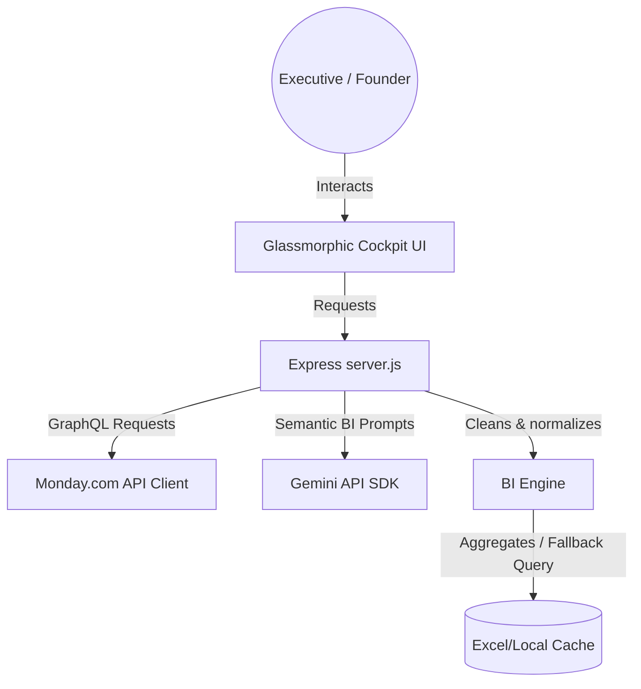

# Monday.com Business Intelligence Agent

This repository contains a full-stack Business Intelligence Agent developed for **Skylark Drones**. The agent integrates with Monday.com boards containing sales pipeline and project execution data, cleans and links inconsistent data, and provides a conversational interface and executive cockpit for leadership updates.

---

## Architecture Overview

The system is built as a lightweight, high-performance Node.js & Express application:



### Components:
1. **Frontend Cockpit (`public/`)**: A dark-themed cockpit built with Vanilla HTML/CSS/JS. Features glassmorphism, responsive visual charts (Chart.js), quick suggestion chips, message markdown parsing (Marked.js), and a leadership update markdown exporter.
2. **Main Server (`src/server.js`)**: An Express server exposing endpoints for chat querying, credentials verification, Excel-to-Monday synchronization, and aggregated dashboard stats. Bypasses browser-side CORS restrictions for Monday.com tokens.
3. **BI Engine (`src/bi-engine.js`)**: Handles data cleaning (header deduplication, sector normalization, serial date parsing, currency formatting) and joins the Deals and Work Orders boards by `Deal Name`. Provides an offline semantic fallback if no Gemini key is provided.
4. **Monday Client (`src/monday-client.js`)**: Interfaces with Monday.com's GraphQL v2 API, creates board structures, sets appropriate column types (date, numbers, text), and batch uploads items securely.

---

## Setup & Running Locally

### 1. Prerequisites
Ensure you have **Node.js (v18+)** and **npm** installed.

### 2. Installation
Navigate to the directory and install dependencies:
```bash
npm install
```

### 3. Setup Configuration (Optional)
You can create a `.env` file in the root directory to store configuration variables (or enter them directly in the UI):
```env
PORT=3000
GEMINI_API_KEY=your_gemini_api_key_here
```

### 4. Running the Application
Start the server in development mode:
```bash
npm start
```
The server will run at: **`http://localhost:3000`**

---

## Monday.com Board Configuration & Excel Sync

To synchronize the messy Excel data directly to Monday.com:

1. **Obtain your Monday.com Token**:
   - Log into Monday.com.
   - Go to your profile picture (bottom left) -> **Administration** -> **API**.
   - Copy your **Personal API Token**.

2. **Sync in the App**:
   - Open the web interface.
   - Toggle the connection mode to **"Live Monday"**.
   - Paste your **Personal API Token** in the sidebar.
   - Click **"Sync Excel"**.
   - The application will automatically:
     - Create a board named **"Skylark Deals"** with appropriate column types.
     - Create a board named **"Skylark Work Orders"** with appropriate column types.
     - Parse, clean, and batch-upload all items from the Excel sheets to these boards.
   - The status box will confirm successful synchronization.

---

## Key Features

1. **Dual Query Engine**: If a Gemini Key is provided, the agent uses Gemini to analyze data and output deep insights. Otherwise, it falls back to a rule-based query engine, making it 100% functional instantly.
2. **Dynamic Dashboard Cockpit**: Tracks total contract values, billed values, collected cash, and outstanding AR. Visualizes data with interactive charts.
3. **Data Quality Meter**: Calculates a board integrity score out of 100, displaying alerts for missing figures or unlinked records.
4. **Leadership Update Generator**: Compiles metrics and recommendations for any quarter or sector. Copy raw markdown or download files instantly.
