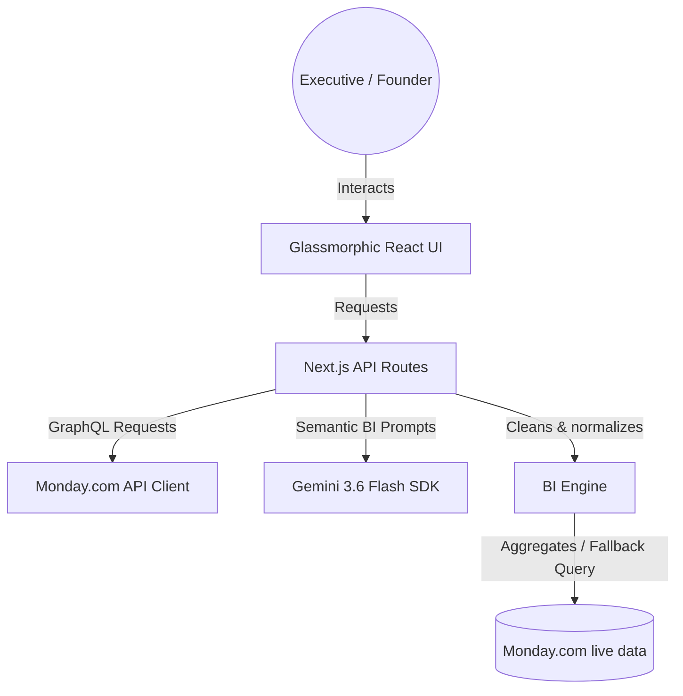

# Monday.com Business Intelligence Agent

This repository contains a full-stack Business Intelligence Agent developed for **Skylark Drones**. The agent integrates with Monday.com boards containing sales pipeline and project execution data, cleans and links inconsistent data, and provides a beautiful, conversational interface and executive cockpit for leadership updates.

 *(Add a screenshot here)*

---

## Architecture Overview

The system is built as a modern, high-performance **Next.js (App Router)** application deployed on **Vercel**:



### Tech Stack:
1. **Frontend**: Next.js 14 (React), Tailwind CSS, Framer Motion (for animations), Lucide React (icons), Recharts (for dynamic visual charts), and ReactMarkdown with remark-gfm (for beautiful markdown rendering).
2. **Backend**: Next.js API Routes (`app/api/*`) handling secure connections to Monday.com and Gemini, entirely bypassing browser-side CORS restrictions and securely hiding API keys.
3. **BI Engine (`src/bi-engine.js`)**: Handles data cleaning (header deduplication, sector normalization, serial date parsing, currency formatting) and joins the Deals and Work Orders boards by `Deal Name`.
4. **Monday Client (`src/monday-client.js`)**: Interfaces with Monday.com's GraphQL v2 API, creates board structures, sets appropriate column types (date, numbers, text), and batch uploads items securely.

---

## Setup & Running Locally

### 1. Prerequisites
Ensure you have **Node.js (v18+)** and **npm** installed.

### 2. Installation
Navigate to the directory and install dependencies:
```bash
npm install
```

### 3. Setup Configuration (Optional)
You can create a `.env.local` file in the root directory to store configuration variables (or enter them directly in the UI):
```env
GEMINI_API_KEY=your_gemini_api_key_here
```

### 4. Running the Application
Start the server in development mode:
```bash
npm run dev
```
The server will run at: **`http://localhost:3000`**

---

## Monday.com Board Configuration & Excel Sync

To synchronize your offline Excel data directly into Monday.com:

1. **Obtain your Monday.com Token**:
   - Log into Monday.com.
   - Go to your profile picture (bottom left) -> **Administration** -> **API**.
   - Copy your **Personal API Token**.

2. **Sync in the App**:
   - Open the web interface.
   - Toggle the connection mode to **"Live Monday"**.
   - Paste your **Personal API Token** in the sidebar.
   - Click **"Sync Excel (Optional)"** and wait 60 seconds.
   - The application will automatically push all local deals and work orders directly into your live Monday.com account!

---

## Key Features

1. **AI Chat Cockpit**: Powered by **Gemini 3.6 Flash**, allowing natural language queries against your live operational data. The output is gorgeously formatted with Markdown tables and styling.
2. **Dynamic Dashboard Cockpit**: Tracks total contract values, billed values, collected cash, and outstanding AR. Visualizes data with interactive Recharts.
3. **Data Quality Meter**: Calculates a board integrity score out of 100, displaying alerts for missing figures or unlinked records.
4. **Leadership Update Generator**: Compiles executive metrics and strategic recommendations for any quarter or sector.
